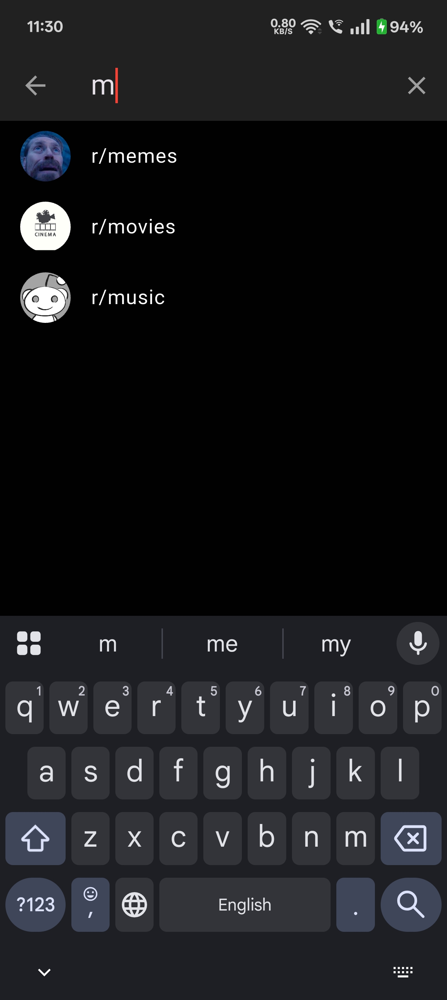

# Reddit Clone Flutter

 Simple Responsive Reddit Clone which works on Android, Ios and Web.

## Key Features

-Google and Guest Authentication

-Create(mod), Join community(members)

-Community Profile (Avatar, Banner, Members)

-Edit Description and Avatar of community

-Post (link only, photo, text only)

-Displaying posts from communities user is part of

-Upvote and Downvote

-Comment

-Award the Post

-Update Karma

-Add Moderators

-Moderator: remove post

-Delete post

-Edit User Profile (Avatar, Banner)

-Theme Switch(Toggling)

-Cross Platform

-Responsive UI

-Latest posts (instead of home, display this to guest users but they should be not able to upvote,downvote or comment on the posts)

## Screenshots

- Login Screen </br>
  

- Home Screen </br>
  

- Community Screen </br>
  

- Comment Section </br>
  

- Community List Drawer </br>
  

- Light Theme </br>
  

- Search Screen </br>
  

- Post Type Screen </br>
  

- User Profile </br>
  

- Edit User Profile </br>
  


## Guide to Installation
Follow the following steps:
- Create Firebase Project
- Enable Authentication (Google Sign In, Guest Sign In) using Firebase Auth
- Make Firestore Rules
- Create Android, iOS & Web Apps
- Use FlutterFire CLI to add the Firebase Project to this app.

Then run the following commands to run your app:

```bash
  flutter pub get (Update every package you initialized in the pubspec.yaml file)
  open -a simulator (to get iOS Simulator)
  flutter build apk (first build the apk and run the command 'flutter run' To run the app in the Android device)
  flutter run
  flutter run -d chrome (To run the app on the Web)
```

## Backend Infrastructure

Authentication & Security: Firebase Authentication

File Storage: Firebase Storage

Database: Firebase Cloud Firestore 

## Frontend Architecture

Framework: Flutter (Cross-platform SDK)

State Management: Riverpod (v2.6.1)

Navigation: Routemaster (v1.0.1)